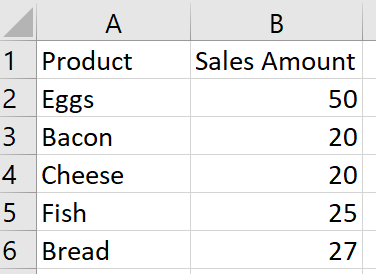
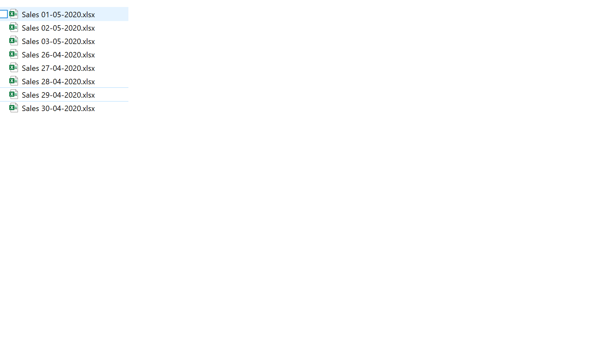
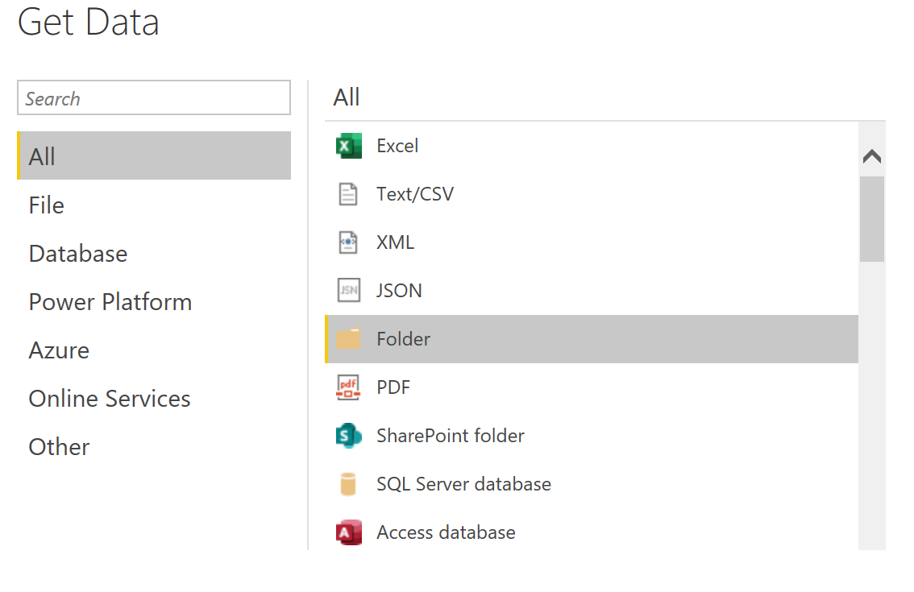
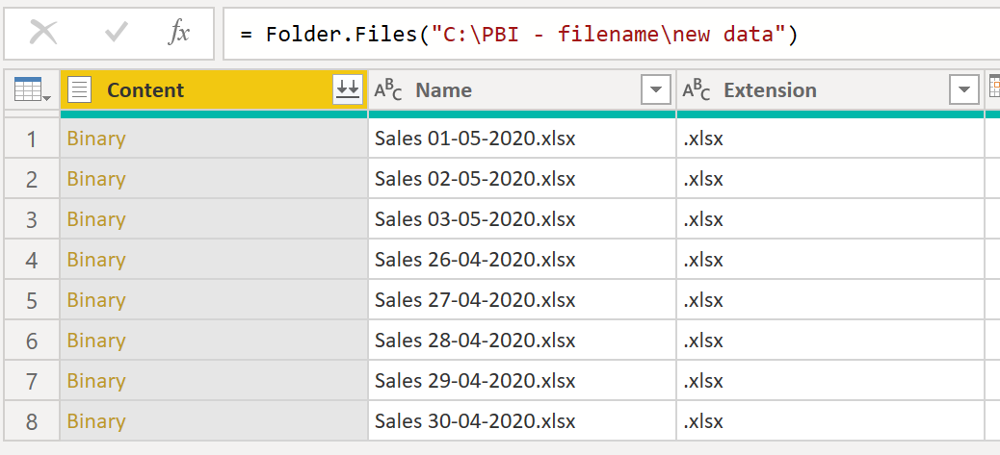
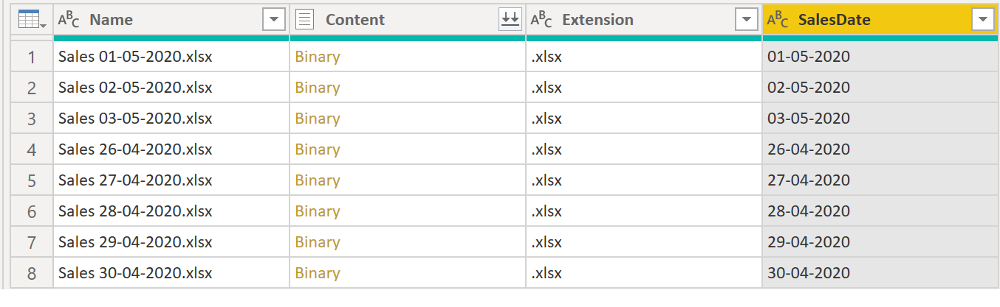
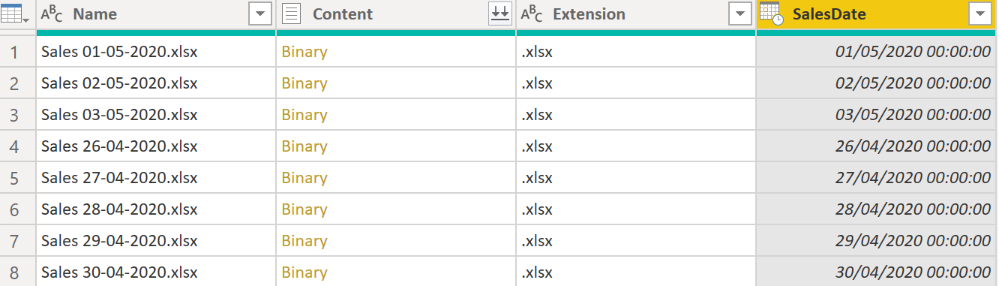
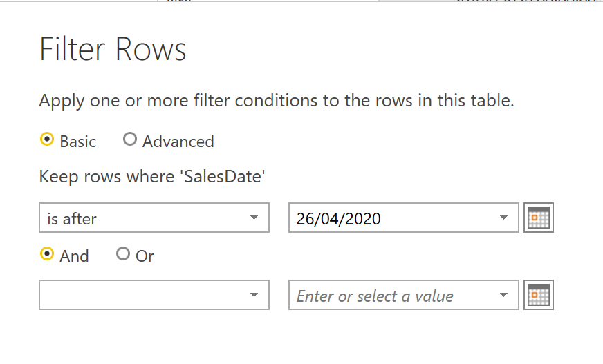

# Power BI: dataset refresh from multiple similar files
Example of how to refresh a Power BI dataset from multiple similar files

## Example Scenario
I have a folder on my local machine where every day a new file is added, containing the aggregated sales numbers that took place during the day. All files have a similar structure, but obviously contain different data. 

All the files adhere to the same naming convention, as seen below in the screenshot below:

It should be noted that the date of the sales is only present in the file names, and not in the file contents. I need to build a report that:
  1) refreshes daily
  2) will include the latest data available at the time of the refresh
  3) will only load the last 7 days worth of data OR the last 7 files available in the folder 
  
  ## Solution
  
  I create a new report, and choose Folder as my data source.

  I enter the path of folder containing all my Sales files and select Transform Data as soon as the option becomes available. I now have a view of all the files present in the folder, or a sample subset if the list is too big. If I continue without any filtering, I will load all the files into my Power BI dataset. 
  

### Only load the last 7 days
  In order to load only the Sales files for the last 7 days, I first need to extract the Sales Date from the file name. I can do this by using the Add Columns From Examples functionality, or by using traditional string operations. Once done, my dataset looks like this:
  
  
  
  I also need to convert the new SalesDate column into a DateTime data type before proceeding
  
  
  
  I now have a Sales Date column I can use to filter only the last 7 days. I apply a filter, using the user interface, to only show the last 7 days (for this example, the last 7 days means the Sales Date is after .
  
  
  
  While this works, I need to manually change the date filter every day, in order to make sure I still get the last 7 days tomorrow. I can do this by aplying a dynamic filter. 
  
  I need to go to the Advanced Editor option, and change the line applying the SalesDate filter just created as follows:
  [TODO] add a description of Advanced Editor
  
  `#"Filtered Rows" = Table.SelectRows(#"Changed Type", each [SalesDate] > Date.AddDays ( DateTime.LocalNow(), -7 ))` 
  This change now calculates the last 7 days based on the current date (`DateTime.LocalNow()`), making sure the refresh will also work tomorrow. If the number of days loaded is likely to change often, I can also use a parameter:
  
  `#"Filtered Rows" = Table.SelectRows(#"Changed Type", each [SalesDate] > Date.AddDays ( DateTime.LocalNow(), -1 * noDays ))`
  
  ### Only load the last 7 files 
  
  ### Merge files
  
  ### Add Date
  
  ### View result 
