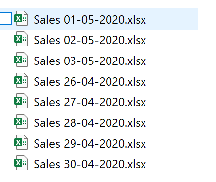
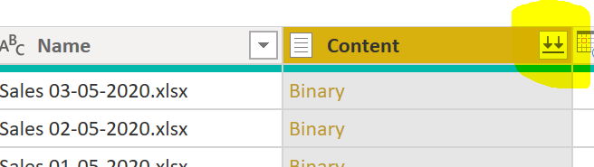

# Power BI: dataset refresh from multiple similar files
Example of how to refresh a Power BI dataset from multiple similar files

## Example Scenario

I have a folder a my local machine / shared drive / SharePoint where every day a new file is added, containing the aggregated sales numbers that took place during the day. All files have a similar structure, but obviously contain different data. 

All the files adhere to the same naming convention, as seen below in the screenshot below.

It should be noted that the date of the sales is only present in the file names, and not in the file contents. I need to build a report that:
  1) refreshes daily
  2) will include the latest data available at the time of the refresh
  3) will only load the last 7 days worth of data OR the last 7 files available in the folder 
  
  ## Solution
  
  I create a new report, and choose Folder as my data source.

  I enter the path to the folder containing all my sales files and select Transform Data as soon as the option becomes available. I now have a view of all the files present in the folder, or a sample subset if the list is too big. If I continue without any filtering, I will load all the files into my Power BI dataset. 
  

### Only load the last 7 days
  In order to load only the files corresponding to the last 7 days, I first need to extract the sales date from the file name. I can do this by using the Add Columns From Examples functionality, or by using traditional string operations. Once done, my dataset looks like this:
  
  
  
  I also need to convert the new SalesDate column into a DateTime data type before proceeding.
  
  
  
  I now have a SalesDate column I can use to filter only the last 7 days. I apply a filter, by using the user interface, to only show the last 7 days (for this example, the last 7 days means the Sales Date is after.
  
  
  
  While this works, I now need to manually change the date filter every day, in order to make sure I still get the last 7 days tomorrow and the days after. I can do this better by applying a dynamic filter. 
  
  In order to apply a dynamic filter, I go to the Advanced Editor option and change the line applying the SalesDate filter just created as follows:
  
  
  
  `#"Filtered Rows" = Table.SelectRows(#"Changed Type", each [SalesDate] > Date.AddDays ( DateTime.LocalNow(), -7 ))` 
  This change now calculates the last 7 days based on the current date (`DateTime.LocalNow()`), making sure the refresh will also work tomorrow. 
  
  If the number of days loaded is likely to change often, I can also use a parameter (I named the parameter noDays in this example):
  
  `#"Filtered Rows" = Table.SelectRows(#"Changed Type", each [SalesDate] > Date.AddDays ( DateTime.LocalNow(), -1 * noDays ))`
  
### Only load the last 7 files 
  In this scenario I might not get a new file every single day. To make sure I still load 7 files in this situation, I will change the filter to load the last 7 files based on sales date (as opposed to the last 7 days loaded above). Please note I could sort by a different column here, depending on the business requirement. 
    
  To implement this, I still have to create my SalesDate column and convert it to DateTIme, just like before. I then sort by the SalesDate column in descending order.    
  
  
  
  The next step is to add an index, starting from 0.
  
      
  
  I now add a filter to only include files with the index less than 7, using the user interface.
  
      
    
  If the number of files I wish to load is likely to change often, I can also use a parameter (I named the parameter noFiles in this example). Once I create the parameter, I just need to change the filter in the Advanced Editor, as follows:
    
  `#"Filtered Rows" = Table.SelectRows(#"Added Index", each [Index] < noFiles)`
  
### Merge files
  I have now made sure I am only loading the files I need to, as opposed to everything that's in the folder. The next step is to merge the content of these files into one Power BI semantic table. In order to do that, I need to click on the Combine Files option in the Content column.
  
     
    
  In the following Combine Files pop-up, I make sure to select the correct tab from my Excel files and check the preview on the right. 
  
     
   
  The resulting table should contain data from all the files loaded.
  
          
    
  
### Add Date
  As you can see from the image above, my resulting table does not contain the sales date column. That is because the source Excel files do not have the sales date as part of their content. The only place I can extract the sales date is from the file name.
  
  Since I already extracted the SalesDate at the begining of this post to help me filter out the files I did not want to use, I can just include that SalesDate in my resulting table. Here's how I do it:
  
  When I click Combine Files, Power BI automatically generates a number of steps in the Applied Steps section of my workbook.
  
        
 
  I click on the little cog icon next to the last Removed Other Columns step, in order to modify the columns being removed.
  
         
  
  Next I select the SalesDate column.
  
         
  
  The resulting table now included the SalesDate, as well as the data from all the relevant files.
  
         
    
  ### Summary 
  1.  Use the Folder data source and point to the relevant folder
  2.  Derive the relevant date from the file name
  3.  
   ##### filter by date
   - Add a filter on the relevant date to only load the most recent 7 files
   - Use a parameter to easily change the number of files to be loaded
   ##### filter by index 
   - Sort the dataset by the relevant date, descending
   - Add an index
   - Add a filter on the index, to only include the most recent 7 files
   - Use a parameter to easily change the number of files to be loaded
  4.  Combine the files
  5.  Change the Remove Columns step to include the SalesDate in the final table
